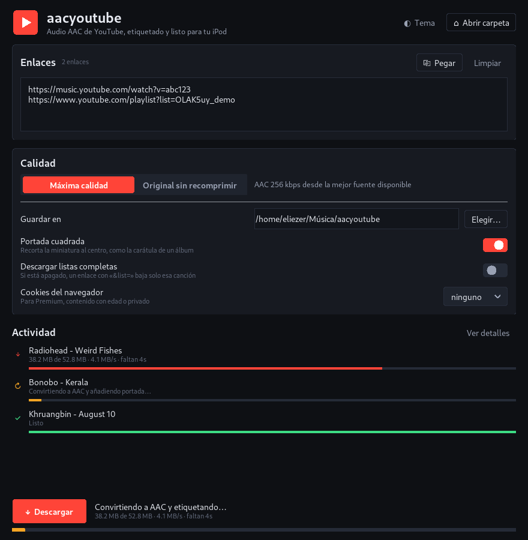

# Uso

- [La ventana](#la-ventana)
- [La terminal](#la-terminal)
- [Calidad](#calidad)
- [Cookies del navegador](#cookies-del-navegador)
- [Cómo quedan los archivos](#cómo-quedan-los-archivos)
- [Pasarlos al iPod](#pasarlos-al-ipod)

---

## La ventana



### Enlaces

Pega uno por línea. Vale cualquier enlace de YouTube o YouTube Music:

```
https://music.youtube.com/watch?v=dQw4w9WgXcQ
https://www.youtube.com/watch?v=dQw4w9WgXcQ
https://youtu.be/dQw4w9WgXcQ
https://music.youtube.com/playlist?list=OLAK5uy_...
```

**Pegar** añade lo que haya en el portapapeles sin borrar lo anterior. **Limpiar** vacía la caja.

### Ajustes

| Ajuste | Qué hace |
|---|---|
| **Calidad** | Máxima (AAC 256 kbps) u original sin recomprimir (~128 kbps) |
| **Guardar en** | Carpeta destino. Por omisión, `Música/aacyoutube` de tu usuario |
| **Portada cuadrada** | Recorta la miniatura al centro. Apágalo si prefieres la miniatura entera, en 16:9 |
| **Descargar listas completas** | Apagado, un enlace con `&list=` baja **solo esa canción**. Encendido, baja el álbum o la lista entera |
| **Cookies del navegador** | Para Premium, contenido con restricción de edad o privado |

Todo se recuerda para la próxima vez.

### Actividad

Cada pista aparece con su propio estado:

| | |
|---|---|
| ↓ | Descargando, con tamaño, velocidad y tiempo restante |
| ↻ | Convirtiendo a AAC, etiquetando e incrustando la portada |
| ✓ | Lista |
| ✕ | No se pudo |

**Ver detalles** abre el registro completo de yt-dlp: es lo que hay que mirar cuando algo falla.

---

## La terminal

El mismo programa, sin ventana. Útil para guiones o por SSH.

```bash
aacyoutube [opciones] URL [URL ...]
```

| Opción | Qué hace |
|---|---|
| `-o`, `--out CARPETA` | Carpeta destino |
| `--copy` | AAC original de YouTube, sin recomprimir |
| `--playlists` | Descarga la lista completa, no solo la canción del enlace |
| `--cookies NAVEGADOR` | `firefox`, `chrome`, `chromium`, `brave`, `edge`, `opera`, `vivaldi`, y `safari` en macOS |
| `--no-square` | No recortar la portada a cuadrado |
| `--gui` | Abre la ventana aunque pases enlaces |
| `--doctor` | Revisa el entorno y sale |
| `-V`, `--version` | Versión |

### Ejemplos

```bash
# Una canción, a la carpeta de siempre
aacyoutube "https://music.youtube.com/watch?v=..."

# Un álbum entero en su propia carpeta
aacyoutube --playlists "https://music.youtube.com/playlist?list=OLAK5uy_..."

# Con tu sesión de YouTube Music Premium, a una carpeta concreta
aacyoutube --cookies firefox -o ~/Música/iPod "https://music.youtube.com/watch?v=..."

# Varias de golpe, desde un archivo de texto
aacyoutube $(cat enlaces.txt)
```

### `--doctor`

Antes de pedir ayuda, ejecútalo y pega el resultado:

```
$ aacyoutube --doctor
aacyoutube 2.0.0
  python       3.14.7 (/home/tú/.local/share/aacyoutube/venv/bin/python)
  plataforma   linux
  yt-dlp       2026.08.19
  ffmpeg       /usr/bin/ffmpeg
  runtime JS   node
  tkinter      Tk 9.0
  destino      /home/tú/Música/aacyoutube
  ajustes      /home/tú/.config/aacyoutube/config.json
```

Sale con código 1 si falta algo imprescindible.

---

## Calidad

### Máxima calidad (lo normal)

Pide, por este orden:

1. AAC de 200 kbps o más — se **copia tal cual**, sin recomprimir. Es lo que sirve YouTube Music a las cuentas Premium.
2. Opus (~160 kbps) — se convierte a **AAC-LC 256 kbps, 44,1 kHz, estéreo**.
3. Lo que haya.

El remuestreo a 44,1 kHz importa: el Opus de YouTube viene a 48 kHz y **un iPod no lo reproduce**.

### Original sin recomprimir

Coge el AAC que YouTube ya sirve (~128 kbps) y no lo toca. Cero pérdida generacional y archivos más pequeños, a cambio de partir de un bitrate menor.

**¿Cuál elegir?** Máxima calidad, salvo que prefieras expresamente no recomprimir. Recodificar Opus a AAC pierde algo, pero menos que quedarse con 128 kbps.

---

## Cookies del navegador

Elige tu navegador en la lista y aacyoutube reutiliza la sesión que ya tienes abierta. Hace falta para:

- **YouTube Music Premium** — desbloquea el AAC de 256 kbps
- **Contenido con restricción de edad**
- **Vídeos privados o no listados** a los que tengas acceso

No escribes ninguna contraseña: yt-dlp lee la cookie del perfil del navegador en tu propio disco.

> **Cierra el navegador antes de descargar.** Chrome y los derivados bloquean su base de cookies mientras están abiertos.

En macOS, elegir `safari` o `chrome` puede hacer que el sistema pida permiso para acceder al Llavero. Es normal: las cookies están cifradas ahí.

---

## Cómo quedan los archivos

**Una canción suelta:**

```
Música/aacyoutube/
└── Bonobo - Kerala.m4a
```

**Un álbum o lista** (con **Descargar listas completas** encendido):

```
Música/aacyoutube/
└── Migration/
    ├── 01 - Bonobo - Migration.m4a
    ├── 02 - Bonobo - Breaks.m4a
    └── 03 - Bonobo - Outlier.m4a
```

Cada archivo lleva dentro artista, título, álbum, número de pista y la portada. Los nombres evitan los caracteres que FAT32 no admite, que es el formato con el que vienen los iPod.

Para comprobar uno:

```bash
ffprobe -hide_banner "Bonobo - Kerala.m4a"
```

---

## Pasarlos al iPod

**Con Música o iTunes** — arrastra los `.m4a` a la biblioteca y sincroniza. Las etiquetas y la portada ya están puestas.

**Con Rockbox** — copia los archivos a la carpeta de música del iPod. Rockbox lee las etiquetas directamente.

**Con un iPod clásico sin iTunes** — herramientas como [GTKPod](https://www.gtkpod.org) o [Rhythmbox](https://wiki.gnome.org/Apps/Rhythmbox) en Linux manejan la base de datos del iPod.
